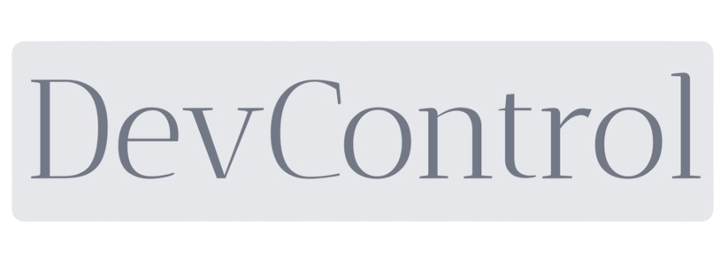

# DevControl

DevControl is a powerful command-line interface tool built in Go using Cobra, Docker Engine API, Bubbletea, and Lipgloss. It allows users to create and manage isolated containers with their desired technology stacks, such as Node.js, Python, Rust, and more.

## Features

- **create**: Create a new isolated container with your desired technology stack.
- **start**: Start an existing container.
- **stop**: Stop a running container.
- **ps**: List containers and their status.
- **images**: List all images.
- **rmi**: Remove images

## Prerequisites

Before using DevControl, ensure that you have the following installed:

- Go (version 1.22 or later)
- Docker

## Installation

You can install DevControl by following these steps:

1. Clone the repository:

```bash
git clone https://github.com/harshau007/DevControl.git
```

2. Navigate to the project directory:

```bash
cd DevControl
```

3. Build the project:

```bash
go build -o devctl
```

4. Move the binarys to a directory included in your system's `PATH` (optional, but recommended for easier access).

## Usage

After installing DevControl, you can use the following commands:

### `create`

```
devctl create [options]
```

Creates a new isolated container with the specified technology stack. Available technologies include `nodejs`, `python`, `rust`, and more.

#### Options

- `--name, -n` (string): Specify a name for the container.
- `--version, -v` (string): Specify the version of the technology stack to use.
- `--package, -p` (string): Specify the ports to expose for the container.

### `start`

```
devctl start [options]
```

Starts the specified container.
#### Options

- `--name, -n` (string): Specify a name for the container.

### `stop`

```
devctl stop [options]
```

Stops the specified running container.
#### Options

- `--name, -n` (string): Specify a name for the container.
### `ps`

```
devctl ps
```

Lists running containers and their status.

- `--all, -a` : List all containers

### `images`

```
devctl images
```

Lists all images.

### `rmi`

```
devctl rmi [id]
```

Remove images.

## Contributing

Contributions to DevControl are welcome! If you find any issues or have suggestions for improvements, please open an issue or submit a pull request.

## License

DevControl is released under the [GNU General Public License](LICENSE).

## Acknowledgments

- [Cobra](https://github.com/spf13/cobra) for the CLI framework.
- [Docker Engine API](https://docs.docker.com/engine/api/) for interacting with Docker.
- [Bubbletea](https://github.com/charmbracelet/bubbletea) for the terminal user interface.